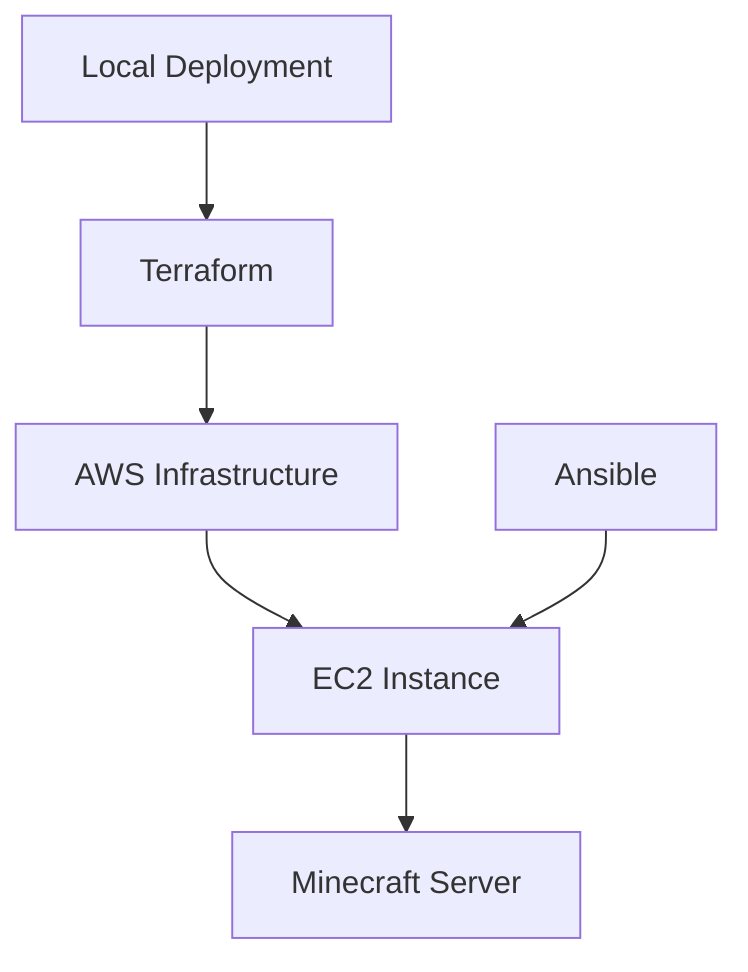

# Automated Minecraft Server Deployment

This repository contains infrastructure as code (IaC) and configuration management scripts to automatically deploy and configure a Minecraft server on AWS. The deployment is fully automated using Terraform for infrastructure provisioning and Ansible for server configuration.

## Background

This project demonstrates modern DevOps practices by automating the deployment of a Minecraft server using:

- Infrastructure as Code (Terraform)
- Configuration Management (Ansible)

## Requirements

### Prerequisites

- AWS CLI v2.x
- Terraform v1.x
- Ansible v2.x
- Git

### AWS Configuration

1. Install AWS CLI and configure credentials:

```bash
aws configure
```

You'll be prompted to enter:
- AWS Access Key ID
- AWS Secret Access Key
- Default region name (e.g., us-west-2)
- Default output format (press Enter for default)

2. For AWS Academy credentials, you may need to manually add the session token:
   - Open `~/.aws/credentials`
   - Add `aws_session_token = your_session_token` under the [default] section
   - The file should look like:
     ```
     [default]
     aws_access_key_id = your_access_key
     aws_secret_access_key = your_secret_key
     aws_session_token = your_session_token
     ```

3. Required AWS permissions:
   - EC2 full access
   - VPC full access
   - IAM role creation
   - Security group management

### SSH Key Pair

The deployment automatically:
1. Generates a new RSA key pair
2. Creates the key pair in AWS
3. Saves the private key as `terraform/minecraft-server-ssh.pem`
4. Uses the key pair for the EC2 instance

The private key file will be created in the `terraform` directory after running `terraform apply`. Keep this file secure as it's needed to SSH into your Minecraft server.

## Deployment Instructions

1. **Infrastructure Provisioning**

   ```bash
   cd terraform
   terraform init
   terraform plan
   terraform apply
   ```

2. **Get Server IP and Set Environment Variable**
   ```bash
   # Get the server IP from Terraform output
   export MINECRAFT_SERVER_IP=$(terraform output -raw minecraft_server_ip)
   ```

3. **Server Configuration**
   ```bash
   cd ../ansible
   ansible-playbook -i inventory.yml minecraft.yml
   ```

## Stopping the Server

### Option 1: Using Terraform (Recommended)

1. Navigate to the terraform directory:
   ```bash
   cd terraform
   ```
2. Destroy the infrastructure:
   ```bash
   terraform destroy
   ```
   This will:
   - Stop and terminate the EC2 instance
   - Remove the security group
   - Clean up any other AWS resources created by Terraform

### Option 2: Through AWS Console

1. Log into AWS Console
2. Navigate to EC2 Dashboard
3. Find your running instance
4. Select the instance and click "Instance state" → "Stop instance"
   - Note: This only stops the instance but keeps all resources intact
   - To completely remove resources, use Option 1 (terraform destroy)

## Architecture



## Verifying the Server

After deployment:

```bash
nmap -sV -Pn -p T:25565 <instance_public_ip>
```

## Connecting to Minecraft Server

1. The server's public IP will be output after Terraform completes
2. Connect using Minecraft client with the server address: `minecraft://<instance_public_ip>:25565`

## Project Structure

```
.
├── README.md
├── terraform/
│   ├── main.tf
│   ├── variables.tf
│   └── outputs.tf
└── ansible/
    ├── inventory.yml
    └── minecraft.yml
```

## Resources and References

- [Minecraft Server Documentation](https://minecraft.net/en-us/download/server)
- [Terraform AWS Provider](https://registry.terraform.io/providers/hashicorp/aws/latest/docs)
- [Ansible Documentation](https://docs.ansible.com/)
