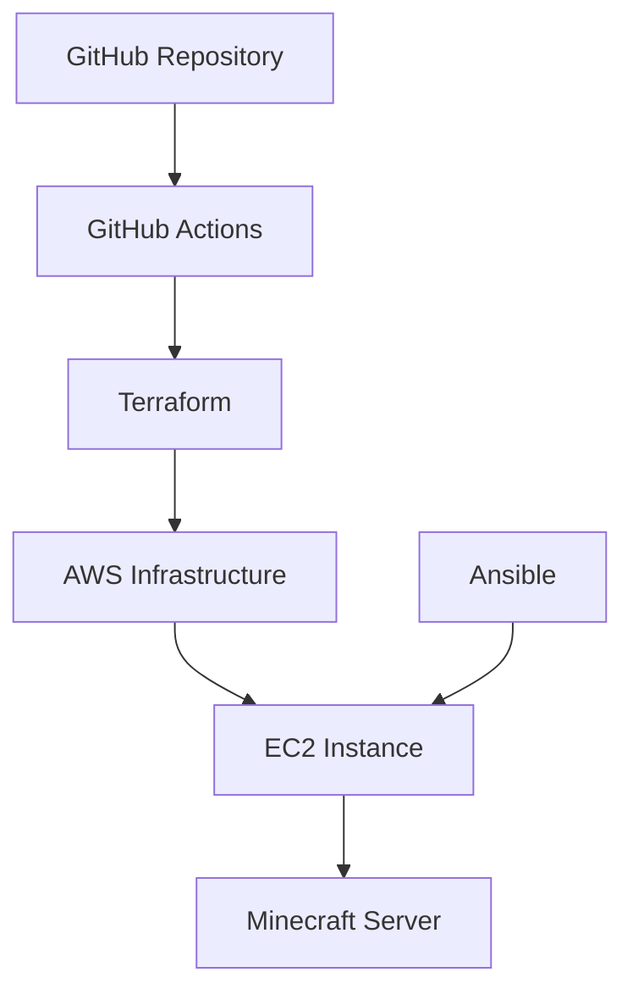

# Automated Minecraft Server Deployment

This repository contains infrastructure as code (IaC) and configuration management scripts to automatically deploy and configure a Minecraft server on AWS. The deployment is fully automated using Terraform for infrastructure provisioning and Ansible for server configuration.

## Background

This project demonstrates modern DevOps practices by automating the deployment of a Minecraft server using:

- Infrastructure as Code (Terraform)
- Configuration Management (Ansible)
- CI/CD (GitHub Actions)

## Requirements

### Prerequisites

- AWS CLI v2.x
- Terraform v1.x
- Ansible v2.x
- Git

### AWS Configuration

1. Install AWS CLI and configure credentials:

```bash
aws configure
```

2. Required AWS permissions:
   - EC2 full access
   - VPC full access
   - IAM role creation
   - Security group management

### Environment Setup

1. Create a `.env` file in the root directory:

```bash
# Copy the example file
cp .env.copy .env

# Edit .env with your credentials
# AWS_ACCESS_KEY_ID=your_access_key
# AWS_SECRET_ACCESS_KEY=your_secret_key
# AWS_REGION=your_preferred_region  # e.g., us-west-2, us-east-1, etc.
```

## Deployment Options

### Option 1: Automated Deployment (Recommended)

This repository is configured to automatically deploy when pushed to GitHub.

1. **Setup GitHub Secrets**

   - Go to your repository's Settings
   - Click "Secrets and variables" → "Actions"
   - Add these secrets:
     - `AWS_ACCESS_KEY_ID`: Your AWS access key
     - `AWS_SECRET_ACCESS_KEY`: Your AWS secret key
     - `AWS_REGION`: Your preferred AWS region (e.g., us-west-2, us-east-1)

2. **Push to GitHub**

   ```bash
   git add .
   git commit -m "Initial commit"
   git push -u origin main
   ```

3. **Monitor Deployment**
   - Go to your GitHub repository
   - Click on "Actions" tab
   - Watch the deployment progress

### Option 2: Manual Deployment

If you prefer to deploy manually, follow these steps:

1. **Set Environment Variables**
   Create a `.env` file in the root directory with:

   ```bash
   AWS_ACCESS_KEY_ID=your_access_key
   AWS_SECRET_ACCESS_KEY=your_secret_key
   AWS_REGION=us-west-2
   ```

2. **Infrastructure Provisioning**

   ```bash
   cd terraform
   terraform init
   terraform plan
   terraform apply
   ```

3. **Server Configuration**
   ```bash
   cd ansible
   ansible-playbook -i inventory.yml minecraft.yml
   ```

## Stopping the Server

### Option 1: Using Terraform (Recommended)

1. Navigate to the terraform directory:
   ```bash
   cd terraform
   ```
2. Destroy the infrastructure:
   ```bash
   terraform destroy
   ```
   This will:
   - Stop and terminate the EC2 instance
   - Remove the security group
   - Clean up any other AWS resources created by Terraform

### Option 2: Through AWS Console

1. Log into AWS Console
2. Navigate to EC2 Dashboard
3. Find your running instance
4. Select the instance and click "Instance state" → "Stop instance"
   - Note: This only stops the instance but keeps all resources intact
   - To completely remove resources, use Option 1 (terraform destroy)

## Monitoring Your Server

### AWS Console Access

1. Log into AWS Console (https://console.aws.amazon.com)
2. **IMPORTANT**: Check that you're in the correct AWS region
   - Look at the region selector in the top-right corner of the console
   - Make sure it matches the region you specified in your GitHub secrets (`AWS_REGION`)
   - If you don't see your instance, the most common reason is being in the wrong region
3. Navigate to EC2 Dashboard
4. You'll see your Minecraft server instance listed with:
   - Instance ID
   - Instance state (running/stopped)
   - Instance type (t4g.small)
   - Public IP address
   - Launch time
   - Security group

### Important AWS Console Features

- **Instance Monitoring**: View CPU, network, and disk usage
- **Instance Connect**: Connect directly to your instance through the browser
- **Security Groups**: View and modify firewall rules
- **Tags**: See the tags applied to your instance
- **Instance Settings**: Modify instance attributes

### Cost Monitoring

- Monitor your AWS costs in the Billing Dashboard
- Set up AWS Budgets to get alerts if costs exceed your threshold
- The t4g.small instance typically costs around $0.0168 per hour (prices may vary by region)

## Architecture



## Verifying the Server

After deployment (either automated or manual):

```bash
nmap -sV -Pn -p T:25565 <instance_public_ip>
```

## Connecting to Minecraft Server

1. The server's public IP will be output after Terraform completes
2. Connect using Minecraft client with the server address: `minecraft://<instance_public_ip>:25565`

## Project Structure

```
.
├── README.md
├── terraform/
│   ├── main.tf
│   ├── variables.tf
│   └── outputs.tf
├── ansible/
│   ├── inventory.yml
│   └── minecraft.yml
└── .github/
    └── workflows/
        └── deploy.yml
```

## Resources and References

- [Minecraft Server Documentation](https://minecraft.net/en-us/download/server)
- [Terraform AWS Provider](https://registry.terraform.io/providers/hashicorp/aws/latest/docs)
- [Ansible Documentation](https://docs.ansible.com/)
- [GitHub Actions Documentation](https://docs.github.com/en/actions)
